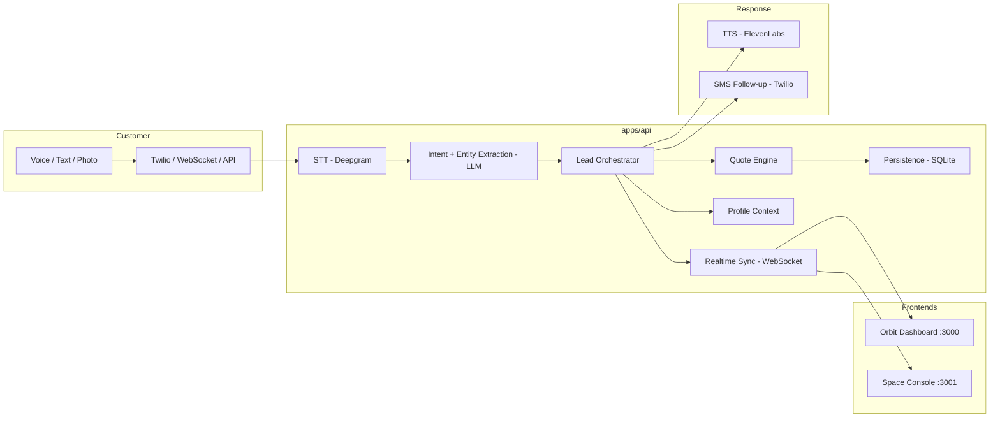

# Sophiie Platform

**Voice-first AI workspace for trade-service operations.**

Sophiie captures customer intent from voice and text, classifies and enriches leads with AI, prices jobs using business-profile rules, and keeps dashboards synced in realtime — all from one continuous flow.

---

## Architecture

```
┌─────────────────────────────────────────────────────────────────────────┐
│                           Monorepo (pnpm + NX)                         │
├──────────────────┬──────────────────┬────────────────┬──────────────────┤
│   apps/customer  │   apps/admin     │   apps/api     │  packages/shared │
│   (Sophiie Orbit)│   (Sophiie Space)│   (FastAPI)    │  (TS utilities)  │
│   Next.js :3000  │   Next.js :3001  │   Python :8000 │                  │
└──────────────────┴──────────────────┴────────────────┴──────────────────┘
```

### Service Map

| Service | Stack | Port | Description |
|---------|-------|------|-------------|
| **Sophiie Orbit** | Next.js 16, React 19, MUI 7 | `3000` | Customer/tradie portal — appointments, calendar, enquiries, voice memos |
| **Sophiie Space** | Next.js 16, React 19, MUI 7 | `3001` | Super-admin console — user management, onboarding, monitoring, inbound setup |
| **API** | FastAPI, SQLAlchemy, aiosqlite | `8000` | Backend — auth, voice pipeline, lead orchestration, integrations, WebSocket |
| **Worker** | Python (LiveKit Agents) | — | Background voice agent for real-time call handling |

---

## Data Flow



### End-to-End Scenario

1. **Customer calls** or submits a request (voice, text, or photo upload).
2. **Ingestion layer** receives the input via Twilio Media Streams, WebSocket, or REST API.
3. **Speech-to-text** (Deepgram) transcribes voice input in real-time.
4. **LLM pipeline** (LangChain + OpenRouter) classifies intent, extracts entities (service type, urgency, location), and assesses job priority.
5. **Profile context** is resolved — business service types, rates, travel radius, working hours.
6. **Quote engine** calculates proposed charges: callout fee + labour + materials + travel + markup.
7. **Lead record** is persisted to the database with full context.
8. **Realtime sync** pushes the new lead/enquiry to all connected dashboards via WebSocket.
9. **Tradie reviews** the enquiry in Orbit, approves or edits the quote.
10. **Customer receives** a follow-up SMS with booking confirmation or photo upload link.

---

## Project Structure

### Backend (`apps/api`)

```
apps/api/
├── main.py                     # FastAPI app entry point
├── init_and_seed.py            # Database initialization and seeding
├── core/
│   └── config.py               # Settings, JWT config, admin bootstrap
├── db/                         # SQLAlchemy database setup
├── models/                     # ORM models (User, Lead, Profile, etc.)
├── schemas/                    # Pydantic request/response schemas
├── routers/
│   ├── auth.py                 # Email/password authentication
│   ├── oauth.py                # Google OAuth flow
│   ├── admin.py                # Admin: onboarding, profiles, stats
│   ├── leads.py                # Lead CRUD + AI enrichment
│   ├── profile.py              # Business profile management
│   ├── voice.py                # Voice pipeline status + config
│   ├── session.py              # Session management
│   ├── search.py               # Full-text search across entities
│   ├── health.py               # Health check endpoints
│   └── ws_leads.py             # WebSocket for realtime lead updates
├── services/
│   ├── ai_service.py           # LangChain/OpenRouter LLM integration
│   ├── lead_orchestrator.py    # End-to-end lead processing pipeline
│   ├── quote_engine.py         # Automated quoting logic
│   ├── profile_context.py      # Business context resolution
│   ├── workspace_service.py    # Workspace component management
│   ├── bootstrap_admin.py      # Auto-create super-admin on startup
│   ├── cache_service.py        # Caching layer
│   ├── lead_cache.py           # Lead-specific cache
│   ├── notifications.py        # Push notification dispatch
│   ├── ai/                     # AI sub-modules
│   ├── integrations/           # Twilio, Deepgram, ElevenLabs wrappers
│   ├── realtime/               # WebSocket event broadcasting
│   └── voice/                  # LiveKit agent, voice pipeline
├── scripts/                    # Utility scripts
└── tests/                      # API test suite
```

### Customer Portal (`apps/customer`)

```
apps/customer/src/
├── app/
│   ├── page.tsx                # Root redirect → /customer-portal or /auth/login
│   ├── auth/login/page.tsx     # Orbit login (email/password + Google OAuth)
│   ├── dashboard/page.tsx      # DashboardShell wrapper (authenticated)
│   ├── customer-portal/page.tsx# DashboardShell wrapper (authenticated)
│   └── customer/page.tsx       # Customer-specific view
├── components/
│   ├── orbit/                  # DashboardShell, CalendarView, EnquiriesView,
│   │                           # NotificationsPanel, VoiceFab, EnquiryPushModal
│   ├── voice/                  # VoiceCapture component (microphone input)
│   ├── workspace/              # TaskCard, StatusIndicator
│   ├── input/                  # TextInput, ActionChips
│   ├── layout/                 # MobileLayout
│   ├── providers/              # AuthProvider, WorkspaceProvider, ThemeProvider
│   └── dashboard/              # Dashboard-specific components
└── lib/                        # Auth context wrappers, theme context
```

### Admin Portal (`apps/admin`)

```
apps/admin/src/
├── app/
│   ├── page.tsx                # Admin dashboard (Overview, Customers, Inbound, Monitoring)
│   └── auth/login/page.tsx     # Space login (email/password only, no OAuth)
├── components/
│   └── providers/              # AuthProvider, ThemeProvider
└── lib/                        # Auth context wrapper, theme context
```

---

## API Endpoints

### Authentication

| Method | Endpoint | Description |
|--------|----------|-------------|
| `POST` | `/auth/login` | Email/password login → JWT token |
| `POST` | `/auth/signup` | Create new user account |
| `GET` | `/auth/me` | Get current user profile |
| `POST` | `/auth/logout` | Blacklist current token |
| `POST` | `/auth/forgot-password` | Send password reset email |
| `POST` | `/auth/reset-password` | Reset password with token |
| `GET` | `/auth/google` | Initiate Google OAuth |
| `GET` | `/auth/google/callback` | Google OAuth callback |

### Admin

| Method | Endpoint | Description |
|--------|----------|-------------|
| `GET` | `/api/admin/profiles` | List all customer profiles |
| `GET` | `/api/admin/stats` | Dashboard metrics (customers, leads, booking rate) |
| `POST` | `/api/admin/onboard` | Create customer + business profile |
| `PATCH` | `/api/admin/profiles/{id}` | Update profile + inbound config |

### Leads

| Method | Endpoint | Description |
|--------|----------|-------------|
| `GET` | `/api/leads` | List leads (filtered by user) |
| `POST` | `/api/leads` | Create lead with AI enrichment |
| `GET` | `/api/leads/{id}` | Get lead details |
| `PATCH` | `/api/leads/{id}` | Update lead status/details |
| `WS` | `/ws/leads` | Realtime lead updates |

### Voice & Monitoring

| Method | Endpoint | Description |
|--------|----------|-------------|
| `GET` | `/api/voice/status` | Deepgram, ElevenLabs, Twilio, WebSocket status |
| `GET` | `/health` | API health check |
| `GET` | `/docs` | Swagger UI (auto-generated) |

---

## Quick Start

### Prerequisites

- **Node.js** 18+ and **pnpm**
- **Python** 3.11+ and **pip** (or **uv**)
- API keys for: Deepgram, ElevenLabs, OpenRouter (see Environment Variables below)

### 1. Install Dependencies

```bash
# Frontend (from project root)
pnpm install

# Backend
cd apps/api && pip install -r requirements.txt
```

### 2. Configure Environment

```bash
cp apps/api/.env.example apps/api/.env
# Edit apps/api/.env with your API keys (see table below)
```

### 3. Start Services

```bash
# Terminal 1 — Backend API
cd apps/api && uvicorn main:app --reload --port 8000

# Terminal 2 — Customer Portal (Sophiie Orbit)
cd apps/customer && npm run dev    # → http://localhost:3000

# Terminal 3 — Admin Portal (Sophiie Space)
cd apps/admin && npm run dev       # → http://localhost:3001
```

### 4. Access

| URL | Service |
|-----|---------|
| [http://localhost:3000](http://localhost:3000) | **Sophiie Orbit** — Customer/Tradie Portal |
| [http://localhost:3001](http://localhost:3001) | **Sophiie Space** — Admin Console |
| [http://localhost:8000/docs](http://localhost:8000/docs) | **API Documentation** (Swagger UI) |
| [http://localhost:8000/health](http://localhost:8000/health) | **Health Check** |

### NX Commands

```bash
npx nx show projects                  # List all projects
npx nx serve customer                 # Start customer portal
npx nx serve admin                    # Start admin portal
npx nx build customer                 # Build customer portal
npx nx build admin                    # Build admin portal
npx nx run-many --target=build        # Build all
```

---

## Default Admin Credentials

The bootstrap super-admin is created automatically at API startup.

| Field | Value |
|-------|-------|
| **Email** | `superadmin@sophiie.ai` |
| **Password** | `d3m0-p@s5` |
| **Login alias** | `demo-SA` |

Override via environment variables:

```bash
BOOTSTRAP_ADMIN_ENABLED=true
BOOTSTRAP_ADMIN_EMAIL=superadmin@sophiie.ai
BOOTSTRAP_ADMIN_PASSWORD=d3m0-p@s5
BOOTSTRAP_ADMIN_NAME="Demo Super Admin"
```

---

## Environment Variables

Set in `apps/api/.env`:

| Variable | Required | Description |
|----------|----------|-------------|
| `SECRET_KEY` | Yes | JWT signing key |
| `DATABASE_URL` | Yes | SQLite or Postgres connection string |
| `FRONTEND_URL` | Yes | Customer portal URL (e.g. `http://localhost:3000`) |
| `DEEPGRAM_API_KEY` | Yes | Real-time speech-to-text |
| `ELEVENLABS_API_KEY` | Yes | Text-to-speech synthesis |
| `OPENROUTER_API_KEY` | Yes | LLM provider for AI classification |
| `LIVEKIT_URL` | Yes | LiveKit server URL for voice agents |
| `LIVEKIT_API_KEY` | Yes | LiveKit API key |
| `LIVEKIT_API_SECRET` | Yes | LiveKit API secret |
| `TWILIO_ACCOUNT_SID` | Optional | SMS and voice calls |
| `TWILIO_AUTH_TOKEN` | Optional | Twilio authentication |
| `GOOGLE_CLIENT_ID` | Optional | Google OAuth (customer portal) |
| `GOOGLE_CLIENT_SECRET` | Optional | Google OAuth |

Frontend environment (`apps/customer/.env.local` and `apps/admin/.env.local`):

```bash
NEXT_PUBLIC_API_URL=http://localhost:8000
NEXT_PUBLIC_WS_URL=ws://localhost:8000
```

---

## Tech Stack

| Layer | Technologies |
|-------|-------------|
| **Frontend** | Next.js 16 (App Router, Turbopack), React 19, MUI 7, Tailwind CSS |
| **Backend** | FastAPI, SQLAlchemy 2.0, aiosqlite, Pydantic v2, WebSockets |
| **AI / Voice** | LiveKit Agents, LangChain, OpenRouter, Deepgram, ElevenLabs |
| **Auth** | JWT (HS256), bcrypt, Google OAuth 2.0 |
| **Database** | SQLite (dev), PostgreSQL (prod) |
| **Infra** | Docker, Railway (multi-service), pnpm workspaces, NX |

---

## Deployment (Railway)

Configured in `railway.toml` for four services:

| Service | Root | Dockerfile | Port |
|---------|------|-----------|------|
| `api` | `apps/api` | `Dockerfile` | 8000 |
| `worker` | `apps/api` | `Dockerfile` | — |
| `customer` | `apps/customer` | `Dockerfile` | 3000 |
| `admin` | `apps/admin` | `Dockerfile` | 3001 |

Each service auto-deploys from the `main` branch on push.

---

## Product Roles

- **Sophiie Space (Admin)** — Internal control plane for monitoring system health, onboarding customers, configuring inbound call numbers, and viewing aggregate metrics across all customer accounts.

- **Sophiie Orbit (Tradie Dashboard)** — Mobile-first workspace for daily trade operations. Handles voicememos, appointment scheduling, real-time enquiry management, calendar views, and quote approvals.

- **Customer Surface** — Customer-facing interactions via SMS, voice calls, and photo upload links triggered from the Orbit workflow.

---

## License

Proprietary. All rights reserved.
