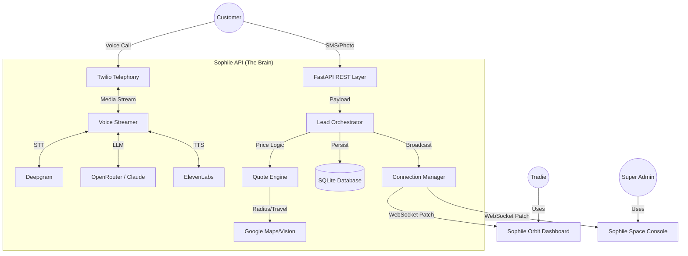

# Sophiie Platform

### Participant

| Field | Your Answer |
|-------|-------------|
| **Name** | Chan RG |
| **University / Employer** | SWE at SiteSee |

### Project

| Field | Your Answer |
|-------|-------------|
| **Project Name** | Sophiie Platform |
| **One-Line Description** | Voice-first AI workspace for trade-service operations. |
| **Demo Video Link** | [Watch Demo](https://www.loom.com/share/41331cf4fa354f959ec51f4a90569983) |
| **Tech Stack** | Next.js 16, React 19, MUI 7, FastAPI, Python 3.11, LiveKit Agents, SQLite/Postgres |
| **AI Provider(s) Used** | Deepgram (STT), ElevenLabs (TTS), OpenRouter (LLM - Claude/GPT), LiveKit (Realtime) |

### About Your Project

#### What does it do?
Sophiie captures customer intent from voice and text, classifies and enriches leads with AI, prices jobs using business-profile rules, and keeps dashboards synced in realtime — all from one continuous flow.

---

## Architecture

## Data Flow

### System Architecture
This diagram outlines how the Sophiie API orchestrates various services and AI providers to keep the Orbit and Space portals synced in real-time.



### End-to-End Sequence (Leaky Tap Scenario)
This flow demonstrates the multimodal journey from a voice call to an automated booking.

```mermaid
sequenceDiagram
    autonumber
    participant C as Customer (Phone)
    participant API as Sophiie API
    participant AI as AI (STT/LLM/TTS)
    participant G as Google (Vision/Maps)
    participant T as Tradie (Orbit App)

    Note over C, AI: Initial Engagement
    C->>API: Calls Tradie Number
    API<->>AI: "G'day! I can help. Can you send a photo of the tap?"
    API->>C: Sends SMS with Upload Link (via Twilio)

    Note over C, G: Multimodal Analysis
    C->>API: Uploads photo of the leaky tap
    API->>G: Identifies tap model & brand (Google Vision)
    API->>API: Searches Bunnings for Part Price ($45.00)

    Note over API, G: Logistics & Pricing
    API->>G: Calculates travel distance (Google Maps)
    API->>API: Total Quote = Callout + Labor + Part + Travel
    
    Note over API, T: Real-time Orchestration
    API-->>T: WebSocket: Push "New Lead" with Photo & Instant Quote
    T->>T: Orbit pulses red. Tradie reviews details.
    T->>API: Clicks [Confirm & Book]

    Note over API, C: Closing Flow
    API->>AI: Trigger TTS response
    AI->>C: "All set! I've booked you in for tomorrow. Total is $235."
    API->>API: Updates Shared Calendar & Leads Table
```

### Simple Flow Explanation
1.  **Smart Intake**: A customer calls. The AI receptionist answers, identifies the issue (e.g., a "leaky tap"), and sends an automated text message asking for a photo.
2.  **Multimodal Analysis**: The customer uploads a photo. The system uses **Google Vision** to recognize the specific part and looks up the current price at local hardware stores.
3.  **Automatic Pricing**: The backend calculates travel distance via **Google Maps** and combines the part price, labor rate, and call-out fee into a complete quote.
4.  **Real-Time Dashboard**: The tradie sees the lead, the photo, and the price appear instantly on their dashboard. They can approve the pre-calculated quote with one click.
5.  **Automated Booking**: Once approved, the AI tells the customer the price, confirms the time, and automatically updates the tradie's calendar.

---

## API Endpoints

### Authentication

| Method | Endpoint | Description |
|--------|----------|-------------|
| `POST` | `/auth/login` | Email/password login → JWT token |
| `POST` | `/auth/signup` | Create new user account |
| `GET` | `/auth/me` | Get current user profile |
| `POST` | `/auth/logout` | Blacklist current token |
| `POST` | `/auth/forgot-password` | Send password reset email |
| `POST` | `/auth/reset-password` | Reset password with token |
| `GET` | `/auth/google` | Initiate Google OAuth |
| `GET` | `/auth/google/callback` | Google OAuth callback |

### Admin

| Method | Endpoint | Description |
|--------|----------|-------------|
| `GET` | `/api/admin/profiles` | List all customer profiles |
| `GET` | `/api/admin/stats` | Dashboard metrics (customers, leads, booking rate) |
| `POST` | `/api/admin/onboard` | Create customer + business profile |
| `PATCH` | `/api/admin/profiles/{id}` | Update profile + inbound config |

### Leads

| Method | Endpoint | Description |
|--------|----------|-------------|
| `GET` | `/api/leads` | List leads (filtered by user) |
| `POST` | `/api/leads` | Create lead with AI enrichment |
| `GET` | `/api/leads/{id}` | Get lead details |
| `PATCH` | `/api/leads/{id}` | Update lead status/details |
| `WS` | `/ws/leads` | Realtime lead updates |

### Voice & Monitoring

| Method | Endpoint | Description |
|--------|----------|-------------|
| `GET` | `/api/voice/status` | Deepgram, ElevenLabs, Twilio, WebSocket status |
| `GET` | `/health` | API health check |
| `GET` | `/docs` | Swagger UI (auto-generated) |

---

## Quick Start

### Prerequisites

- **Node.js** 18+ and **pnpm**
- **Python** 3.11+ and **pip** (or **uv**)
- API keys for: Deepgram, ElevenLabs, OpenRouter (see Environment Variables below)

### 1. Install Dependencies

```bash
# Frontend (from project root)
pnpm install

# Backend
cd apps/api && pip install -r requirements.txt
```

### 2. Configure Environment

```bash
cp apps/api/.env.example apps/api/.env
# Edit apps/api/.env with your API keys (see table below)
```

### 3. Start Services

```bash
# Terminal 1 — Backend API
cd apps/api && uvicorn main:app --reload --port 8000

# Terminal 2 — Customer Portal (Sophiie Orbit)
cd apps/customer && npm run dev    # → http://localhost:3000

# Terminal 3 — Admin Portal (Sophiie Space)
cd apps/admin && npm run dev       # → http://localhost:3001

# Terminal 4 — Tradie Voice Worker (Assistant)
pnpm worker:tradie

# Terminal 5 — Customer Voice Worker (Receptionist)
pnpm worker:customer
```

> **Shortcut:** `pnpm dev` starts the API + both frontends in parallel via NX.

### 4. Access

| URL | Service |
|-----|---------|
| [http://localhost:3000](http://localhost:3000) | **Sophiie Orbit** — Customer/Tradie Portal |
| [http://localhost:3001](http://localhost:3001) | **Sophiie Space** — Admin Console |
| [http://localhost:8000/docs](http://localhost:8000/docs) | **API Documentation** (Swagger UI) |
| [http://localhost:8000/health](http://localhost:8000/health) | **Health Check** |

### NX Commands

```bash
npx nx show projects                  # List all projects
npx nx serve customer                 # Start customer portal
npx nx serve admin                    # Start admin portal
npx nx build customer                 # Build customer portal
npx nx build admin                    # Build admin portal
npx nx run-many --target=build        # Build all
```

---

## Default Admin Credentials

The bootstrap super-admin is created automatically at API startup.

| Field | Value |
|-------|-------|
| **Email** | `superadmin@sophiie.ai` |
| **Password** | `d3m0-p@s5` |
| **Login alias** | `demo-SA` |

Override via environment variables:

```bash
BOOTSTRAP_ADMIN_ENABLED=true
BOOTSTRAP_ADMIN_EMAIL=superadmin@sophiie.ai
BOOTSTRAP_ADMIN_PASSWORD=d3m0-p@s5
BOOTSTRAP_ADMIN_NAME="Demo Super Admin"
```

---

## Environment Variables

Set in `apps/api/.env`:

| Variable | Required | Description |
|----------|----------|-------------|
| `SECRET_KEY` | Yes | JWT signing key |
| `DATABASE_URL` | Yes | SQLite or Postgres connection string |
| `FRONTEND_URL` | Yes | Customer portal URL (e.g. `http://localhost:3000`) |
| `DEEPGRAM_API_KEY` | Yes | Real-time speech-to-text |
| `ELEVENLABS_API_KEY` | Yes | Text-to-speech synthesis |
| `OPENROUTER_API_KEY` | Yes | LLM provider for AI classification |
| `LIVEKIT_URL` | Yes | LiveKit server URL for voice agents |
| `LIVEKIT_API_KEY` | Yes | LiveKit API key |
| `LIVEKIT_API_SECRET` | Yes | LiveKit API secret |
| `TWILIO_ACCOUNT_SID` | Optional | SMS and voice calls |
| `TWILIO_AUTH_TOKEN` | Optional | Twilio authentication |
| `GOOGLE_CLIENT_ID` | Optional | Google OAuth (customer portal) |
| `GOOGLE_CLIENT_SECRET` | Optional | Google OAuth |

Frontend environment (`apps/customer/.env.local` and `apps/admin/.env.local`):

```bash
NEXT_PUBLIC_API_URL=http://localhost:8000
NEXT_PUBLIC_WS_URL=ws://localhost:8000
```

---

## Tech Stack

| Layer | Technologies |
|-------|-------------|
| **Frontend** | Next.js 16 (App Router, Turbopack), React 19, MUI 7, Tailwind CSS |
| **Backend** | FastAPI, SQLAlchemy 2.0, aiosqlite, Pydantic v2, WebSockets |
| **AI / Voice** | LiveKit Agents 1.4, LangChain, OpenRouter, Deepgram Nova-2, ElevenLabs |
| **Auth** | JWT (HS256), bcrypt, Google OAuth 2.0 |
| **Database** | SQLite (dev), PostgreSQL (prod) |
| **Infra** | pnpm workspaces, NX, Docker Compose (local DB/Redis) |

---

## Voice Architecture

The platform uses a **dual-worker** architecture for voice AI, powered by [LiveKit Agents](https://docs.livekit.io/agents/):

| Worker | File | Role | Dispatch Filter |
|--------|------|------|------------------|
| **Tradie Worker** | `tradie_worker.py` | Assistant — jobs, SMS, SDUI | `identity.startsWith("user-")` |
| **Customer Worker** | `customer_worker.py` | Receptionist — lead intake, area check | All other participants |

### Voice Features

- **VoiceFab** — Microphone button in Orbit connects to the Tradie Worker for hands-free assistant interaction.
- **Inbound Calls** — Customer calls are handled by the Customer Worker as a virtual receptionist (Twilio → LiveKit).
- **SDUI** — The assistant can push UI components to the dashboard in real-time (e.g. "Show me jobs for tomorrow").
- **Smart Actions** — Tools for SMS notifications ("I'm running 15 mins late"), outbound calls, and lead logging.
- **Live Call Status** — Real-time "Active Call" banner on the dashboard via WebSocket events.

### Twilio Configuration (Optional)

To enable inbound phone calls, you must expose your local server to the internet using `ngrok` and configure your Twilio Phone Number:

1.  **Start ngrok**:
    ```bash
    ngrok http 8000
    ```
2.  **Copy the Forwarding URL** (e.g., `https://1234-abcd.ngrok-free.app`).
3.  **Configure Twilio**:
    - Go to [Twilio Console > Phone Numbers](https://console.twilio.com/).
    - Select your tracking number (e.g., `+91...`).
    - Under **Voice & Fax**, set the **"A Call Comes In"** Webhook to:
      `YOUR_NGROK_URL/api/voice/incoming`
    - Ensure the method is `POST`.
4.  **Save** and call the number to test.

---

## Product Roles

### 🪐 Sophiie Orbit (The Operation)
Mobile-first workspace for **Trade Professionals** to manage daily operations.
- **Enquiry Management**: Real-time leads from voice/text calls.
- **Hands-free AI**: Voice Assistant (VoiceFab) for scheduling and SMS.
- **Quote Approvals**: Review and dispatch AI-generated quotes.

### 🌌 Sophiie Space (The Command Center)
Internal control plane for **Platform Administrators**.
- **User Onboarding**: Configure tradie business profiles, rates, and service areas.
- **Voice Orchestration**: Map Twilio numbers to specific AI personas.
- **System Monitoring**: Track voice pipeline health and business performance.

- **Customer Surface** — Customer-facing interactions via SMS, voice calls, and photo upload links triggered from the Orbit workflow.

---

## License

Proprietary. All rights reserved.
