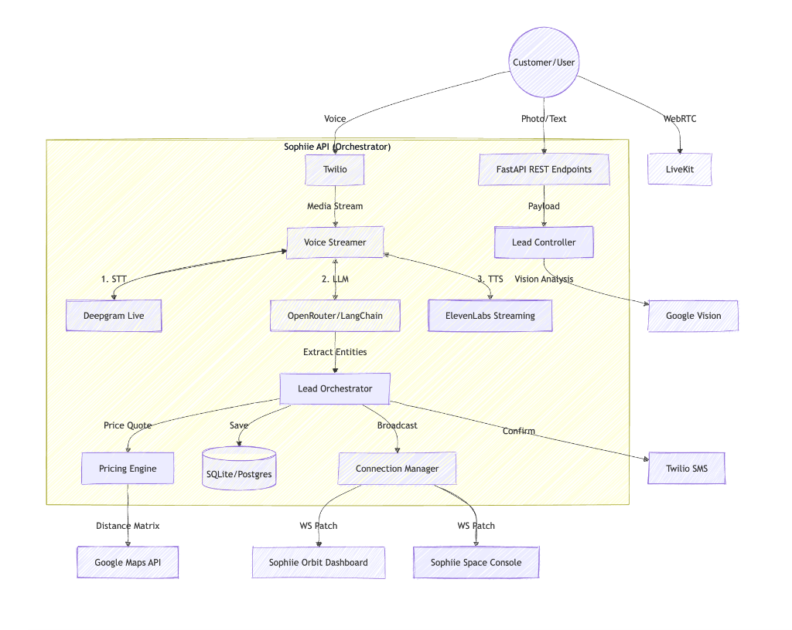
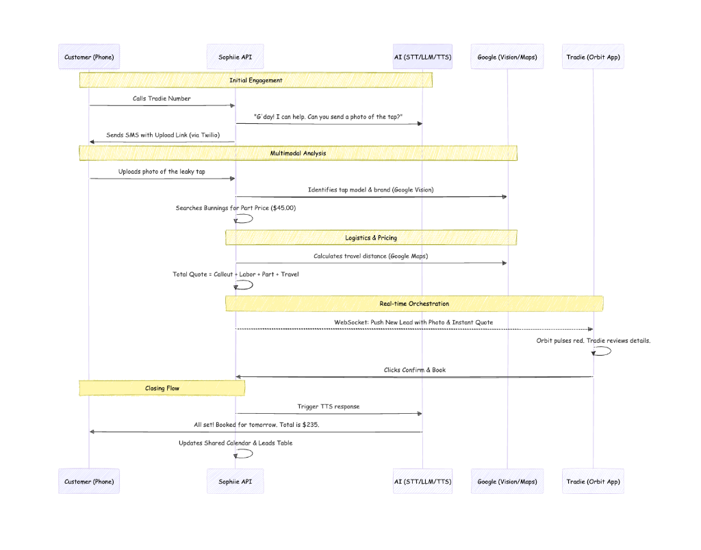

# Sophiie Platform

### Participant

| Field | Your Answer |
|-------|-------------|
| **Name** | Chan RG |
| **University / Employer** | SWE at SiteSee |

### Project

| Field | Your Answer |
|-------|-------------|
| **Project Name** | Sophiie Platform |
| **One-Line Description** | Voice-first AI workspace for trade-service operations. |
| **Demo Video Link** | [Watch Demo](https://www.loom.com/share/41331cf4fa354f959ec51f4a90569983) |
| **Tech Stack** | Next.js 16, React 19, MUI 7, FastAPI, Python 3.11, LiveKit Agents, SQLite |
| **AI Provider(s) Used** | Deepgram (STT), ElevenLabs (TTS), OpenRouter (LLM - Claude/GPT), LiveKit (Realtime) |

### About Your Project

#### What does it do?

Sophiie is a voice-first AI platform that automates the end-to-end workflow for trade-service businesses — from customer intake to job confirmation. A customer calls a tradie's business number. Instead of hitting voicemail, an AI receptionist picks up, understands the problem, collects details, and logs a structured lead in real-time.

The system then enriches that lead automatically: it calculates travel distance, estimates pricing using the tradie's own rates and live parts lookup, and can even analyse photos of the job (e.g. a leaky tap) using vision AI. The tradie sees the fully enriched lead appear live on their dashboard and can approve the quote with one tap. Once approved, the AI calls the customer back, confirms the price and time, and books the job.

Everything flows through two portals: **Sophiie Orbit** (the tradie's mobile-first workspace) and **Sophiie Space** (the admin control plane for onboarding and monitoring).

#### How does the interaction work?

The primary interaction is **voice**. A customer dials a phone number — the AI receptionist answers immediately, has a natural conversation, and extracts structured data (name, address, issue, urgency). After the call, the system sends an SMS with a photo-upload link for visual assessment.

On the tradie side, the **VoiceFab** button provides a hands-free assistant. Tradies can ask "What jobs do I have tomorrow?" or say "Text the customer I'm running 15 minutes late" — the AI handles it through natural speech, pushing UI updates to the dashboard in real-time (SDUI).

Both portals show **live connection status**, **real-time WebSocket updates**, and **push-banner alerts** when new leads arrive. The entire system stays synchronised through persistent WebSocket connections.

#### What makes it special?

1. **Multimodal pipeline** — voice, text, photo, and vision AI all feed into the same lead enrichment flow.
2. **Dual-worker architecture** — two specialised LiveKit voice agents (receptionist + tradie copilot) dispatch automatically based on caller identity.
3. **SDUI (Server-Driven UI)** — the AI assistant can push UI components to the dashboard in real-time, not just respond with text.
4. **Full loop automation** — from intake → enrichment → pricing → quote → confirmation → booking, with human-in-the-loop only at the approval step.
5. **Production-grade UX** — not a chatbot demo. Proper empty states, error handling, connection indicators, Snackbar feedback, and responsive layouts.

---

## Architecture

### System Architecture


The platform is a **monorepo** (`pnpm workspaces` + `NX`) with three main packages and a shared backend:

```
hackathon/
├── apps/
│   ├── customer/    → Sophiie Orbit (Next.js 16, port 3000)
│   ├── admin/       → Sophiie Space  (Next.js 16, port 3001)
│   └── api/         → FastAPI backend (port 8000)
│       ├── routers/         → REST + WebSocket endpoints
│       ├── services/
│       │   ├── voice/       → LiveKit agent workers
│       │   ├── integrations/→ Vision, Distance, Pricing, SMS
│       │   └── realtime/    → WebSocket connection manager
│       ├── models/          → SQLAlchemy ORM models
│       └── schemas/         → Pydantic request/response schemas
├── docs/diagrams/           → Architecture & sequence diagrams
└── nx.json                  → NX workspace config
```

#### Layer Breakdown

| Layer | Responsibility | Key Files |
|-------|---------------|-----------|
| **Frontends** | Two Next.js 16 apps (App Router + Turbopack). Orbit is the tradie workspace; Space is the admin console. Both use MUI 7 with dark/light mode. | `apps/customer/`, `apps/admin/` |
| **API Gateway** | FastAPI with async endpoints, JWT auth, WebSocket hubs for sessions and leads. Handles CORS, error boundaries, and request validation. | `apps/api/main.py`, `routers/` |
| **Voice Workers** | Two LiveKit Agent workers. The **Customer Worker** acts as a receptionist (inbound calls via Twilio → LiveKit). The **Tradie Worker** acts as a copilot (VoiceFab → LiveKit). Both use Deepgram STT + ElevenLabs TTS. | `services/voice/customer_worker.py`, `services/voice/tradie_worker.py` |
| **Lead Orchestrator** | Coordinates enrichment after a lead is captured: runs distance calculation (Google Maps), vision analysis (Google Vision / OpenRouter), and pricing (business-profile rates + live SerpAPI parts lookup). | `services/lead_orchestrator.py` |
| **Realtime Hub** | WebSocket connection manager broadcasts lead events, call status, and SDUI patches to all connected clients. Supports per-user and per-role targeting. | `services/realtime/connection_manager.py` |
| **Database** | SQLite via SQLAlchemy 2.0 (async, aiosqlite). Models: User, UserProfile, LeadSession. Auto-init and seed on startup. | `models/`, `db/` |

#### Data Flow

When a customer calls:

1. **Twilio** receives the call and forwards to `/api/voice/incoming`
2. The API creates a **LiveKit room** and connects the **Customer Worker** agent
3. The agent conducts a natural conversation, extracting structured lead data
4. On call end, the lead is persisted and the **Lead Orchestrator** enriches it:
   - Distance calculation (Google Maps API)
   - Photo analysis (Google Vision → part identification)
   - Price estimation (business rates + live SerpAPI hardware-store lookup)
5. The enriched lead is broadcast via **WebSocket** to all connected Orbit dashboards
6. The tradie reviews, approves, and the system triggers an outbound confirmation call

### End-to-End Sequence (Leaky Tap Scenario)


This flow demonstrates the full multimodal journey from a voice call → SMS photo request → vision analysis → automated pricing → tradie approval → customer confirmation.

---

## Tech Stack

| Layer | Technologies |
|-------|-------------|
| **Frontend** | Next.js 16 (App Router, Turbopack), React 19, MUI 7 |
| **Backend** | FastAPI, SQLAlchemy 2.0, aiosqlite, Pydantic v2, WebSockets |
| **AI / Voice** | LiveKit Agents 1.4, OpenRouter (Claude/GPT), Deepgram Nova-2 (STT), ElevenLabs (TTS) |
| **Integrations** | Google Vision, Google Maps Distance Matrix, SerpAPI (live parts pricing), Twilio (telephony + SMS) |
| **Auth** | JWT (HS256), bcrypt, Google OAuth 2.0 |
| **Database** | SQLite (aiosqlite) |
| **Infra** | pnpm workspaces, NX monorepo |

---

## Voice Architecture

The platform uses a **dual-worker** architecture for voice AI, powered by [LiveKit Agents](https://docs.livekit.io/agents/):

| Worker | File | Role | Dispatch Filter |
|--------|------|------|-----------------|
| **Tradie Worker** | `tradie_worker.py` | Copilot — jobs, SMS, SDUI | `identity.startsWith("user-")` |
| **Customer Worker** | `customer_worker.py` | Receptionist — lead intake, area check | All other participants |

### Voice Features

- **VoiceFab** — Microphone button in Orbit connects to the Tradie Worker for hands-free assistant interaction. Includes retry-on-failure, multi-state labels (Connecting/Listening/Speaking), and live transcript display.
- **Inbound Calls** — Customer calls are handled by the Customer Worker as a virtual receptionist (Twilio → LiveKit).
- **SDUI** — The assistant can push UI components to the dashboard in real-time (e.g. "Show me jobs for tomorrow").
- **Smart Actions** — Tools for SMS notifications ("I'm running 15 mins late"), outbound calls, and lead logging.
- **Live Call Status** — Real-time "Active Call" banner on the dashboard via WebSocket events.

### Twilio Configuration (Optional)

To enable inbound phone calls, expose your local server via `ngrok` and configure Twilio:

1.  **Start ngrok**:
    ```bash
    ngrok http 8000
    ```
2.  **Copy the Forwarding URL** (e.g., `https://1234-abcd.ngrok-free.app`).
3.  **Configure Twilio**:
    - Go to [Twilio Console > Phone Numbers](https://console.twilio.com/).
    - Select your tracking number.
    - Under **Voice & Fax**, set the **"A Call Comes In"** Webhook to:
      `YOUR_NGROK_URL/api/voice/incoming`
    - Ensure the method is `POST`.
4.  **Save** and call the number to test.

---

## Product Roles

### 🪐 Sophiie Orbit (The Operation)
Mobile-first workspace for **Trade Professionals** to manage daily operations.
- **Enquiry Management**: Real-time leads with inline location, distance, and estimate data. Snackbar feedback on call actions.
- **Hands-free AI**: Voice Assistant (VoiceFab) with retry-on-failure, multi-state labels, and live transcripts.
- **Quote Approvals**: Review and dispatch AI-generated quotes via push-banner modal.
- **Smart States**: Empty-state illustrations, relative timestamps, and live connection indicators (Live/Offline chip in app bar).
- **SMS Photo Request**: Toggle in the user menu to enable/disable automatic SMS photo requests after lead capture. Persisted per-profile via the API.
- **Appointment Tracking**: Today's schedule with status-coded cards, connection badge, and friendly empty-day messaging.

> [!TIP]
> **Mobile Utility**: A native mobile app experience is critical for tradies, allowing them to manage their workspace, receive real-time lead alerts, and use the voice assistant while on the job or between sites.

### 🌌 Sophiie Space (The Command Center)
Internal control plane for **Platform Administrators**.
- **Dashboard Overview**: Stat cards with colored icons, live agent stage chip (pulse animation), and AI pipeline status.
- **User Onboarding**: Configure tradie business profiles, rates, and service areas.
- **Customer Management**: Searchable customer table with service-type chips, status badges, and empty-state guidance.
- **Voice Orchestration**: Map Twilio numbers to specific AI personas with validated inbound setup.
- **System Monitoring**: Status-dot indicators (green/red) for Deepgram, ElevenLabs, Twilio. Voice event timeline feed. Token testing tools.

---

## How to Run

### Prerequisites

- **Node.js** 20+ and **pnpm** (required by `package.json`)
- **Python** 3.11+ and **uv** (recommended) or **pip**
- `ngrok` (only needed for Twilio inbound call testing from public internet)

### 1. Install Dependencies

```bash
# Monorepo deps (from project root)
pnpm install

# Backend deps (choose one)
cd apps/api && uv sync
# OR
cd apps/api && pip install -r requirements.txt
```

### 2. Configure Environment

```bash
cp apps/api/.env.example apps/api/.env
# Edit apps/api/.env (full variable matrix is below)
```

Optional frontend env files:

```bash
# apps/customer/.env.local
NEXT_PUBLIC_API_URL=http://localhost:8000
NEXT_PUBLIC_WS_URL=ws://localhost:8000

# apps/admin/.env.local
NEXT_PUBLIC_API_URL=http://localhost:8000
NEXT_PUBLIC_WS_URL=ws://localhost:8000
```

### 3. Start Services

Run everything via NX:

```bash
# API + customer + admin in parallel
npx nx run-many --target=serve --projects=api,customer,admin --parallel=3 --output-style=stream
```

Or run individually:

```bash
# Terminal 1 — Backend API (NX)
npx nx serve api

# Terminal 2 — Customer Portal (NX)
npx nx serve customer

# Terminal 3 — Admin Portal (NX)
npx nx serve admin
```

Or without NX:

```bash
# Terminal 1 — Backend API
cd apps/api && uv run uvicorn main:app --reload --host 0.0.0.0 --port 8000

# Terminal 2 — Customer Portal
cd apps/customer && npx next dev -p 3000

# Terminal 3 — Admin Portal
cd apps/admin && npx next dev -p 3001

# Terminal 4 — Tradie Voice Worker (Assistant)
pnpm worker:tradie

# Terminal 5 — Customer Voice Worker (Receptionist)
pnpm worker:customer
```

> **Shortcut:** `pnpm dev` starts API + both portals via NX.

### 4. Access

| URL | Service |
|-----|---------|
| [http://localhost:3000](http://localhost:3000) | **Sophiie Orbit** — Tradie Portal |
| [http://localhost:3001](http://localhost:3001) | **Sophiie Space** — Admin Console |
| [http://localhost:8000/docs](http://localhost:8000/docs) | **API Documentation** (Swagger UI) |
| [http://localhost:8000/health](http://localhost:8000/health) | **Health Check** |

### NX Commands

```bash
npx nx show projects                  # List all projects
npx nx run-many --target=serve --projects=api,customer,admin --parallel=3
npx nx serve customer                 # Start customer portal
npx nx serve admin                    # Start admin portal
npx nx serve api                      # Start backend
npx nx build customer                 # Build customer portal
npx nx build admin                    # Build admin portal
npx nx run-many --target=build        # Build all
```

### Port / Process Checks

If NX fails with `EADDRINUSE`, stop existing processes first:

```bash
lsof -nP -iTCP:8000 -sTCP:LISTEN
lsof -nP -iTCP:3000 -sTCP:LISTEN
lsof -nP -iTCP:3001 -sTCP:LISTEN
```

Quick health checks:

```bash
curl http://localhost:8000/health
curl -I http://localhost:3000
curl -I http://localhost:3001
```

---

## Default Admin Credentials

The bootstrap super-admin is created automatically at API startup.

| Field | Value |
|-------|-------|
| **Email** | `superadmin@sophiie.ai` |
| **Password** | `d3m0-p@s5` |

Override via environment variables:

```bash
BOOTSTRAP_ADMIN_ENABLED=true
BOOTSTRAP_ADMIN_EMAIL=superadmin@sophiie.ai
BOOTSTRAP_ADMIN_PASSWORD=d3m0-p@s5
BOOTSTRAP_ADMIN_NAME="Demo Super Admin"
```

---

## Environment Variables

Set in `apps/api/.env`:

| Variable | Required | Description |
|----------|----------|-------------|
| `DEBUG` | Optional | FastAPI debug flag (`false` by default) |
| `SECRET_KEY` | Yes | JWT signing key |
| `DATABASE_URL` | Yes | DB URL (`sqlite+aiosqlite:///./spatial_voice.db` by default) |
| `FRONTEND_URL` | Yes | Used in OAuth callback redirects and SMS photo links |
| `CORS_ORIGINS` | Optional | Allowed origins list |
| `ADMIN_EMAILS` | Optional | Admin allow-list |
| `BOOTSTRAP_ADMIN_ENABLED` | Optional | Create default admin user on startup |
| `BOOTSTRAP_ADMIN_ALIAS` | Optional | Default admin alias |
| `BOOTSTRAP_ADMIN_EMAIL` | Optional | Default admin email |
| `BOOTSTRAP_ADMIN_PASSWORD` | Optional | Default admin password |
| `BOOTSTRAP_ADMIN_NAME` | Optional | Default admin full name |
| `OPENROUTER_API_KEY` | Required for AI + vision fallback | LLM + multimodal provider |
| `OPENROUTER_MODEL` | Optional | Primary LLM model |
| `OPENROUTER_VISION_MODEL` | Optional | Preferred vision model |
| `OPENROUTER_BASE_URL` | Optional | OpenRouter API base URL |
| `GOOGLE_CLOUD_VISION_KEY` | Optional | Vision provider fallback (after OpenRouter) |
| `GOOGLE_MAPS_API_KEY` | Optional | Distance Matrix primary provider |
| `SERPAPI_API_KEY` | Optional | Live parts pricing via Google Shopping |
| `PRICING_LIVE_ENABLED` | Optional | Toggle live pricing lookup |
| `TWILIO_ACCOUNT_SID` | Required for live SMS/calls | Twilio account SID |
| `TWILIO_AUTH_TOKEN` | Required for live SMS/calls | Twilio auth token |
| `TWILIO_PHONE_NUMBER` | Required for live SMS/calls | Purchased Twilio number |
| `DEEPGRAM_API_KEY` | Required for voice transcription | Deepgram STT |
| `ELEVENLABS_API_KEY` | Required for voice responses | ElevenLabs TTS |
| `ELEVENLABS_VOICE_ID` | Optional | Voice ID override |
| `LIVEKIT_API_KEY` | Required for LiveKit agents | LiveKit API key |
| `LIVEKIT_API_SECRET` | Required for LiveKit agents | LiveKit API secret |
| `LIVEKIT_URL` | Required for LiveKit agents | LiveKit WS endpoint |
| `GOOGLE_CLIENT_ID` | Optional | Google OAuth login |
| `GOOGLE_CLIENT_SECRET` | Optional | Google OAuth login |
| `GOOGLE_REDIRECT_URI` | Optional | OAuth callback (`/auth/google/callback`) |
| `REDIS_ENABLED` | Optional | Enable Redis cache path |
| `REDIS_URL` | Optional | Redis connection URL |
| `DEFAULT_BUSINESS_NAME` | Optional | Fallback business profile |
| `DEFAULT_BASE_ADDRESS` | Optional | Fallback base address |
| `DEFAULT_CALLOUT_FEE` | Optional | Fallback pricing |
| `DEFAULT_HOURLY_RATE` | Optional | Fallback pricing |
| `DEFAULT_MARKUP_PCT` | Optional | Fallback pricing |

Complete copy-paste templates and validation steps:
`docs/env.checklist.md`

Frontend environment (`apps/customer/.env.local` and `apps/admin/.env.local`):

```bash
NEXT_PUBLIC_API_URL=http://localhost:8000
NEXT_PUBLIC_WS_URL=ws://localhost:8000
```

### Live Call Setup (Twilio + LiveKit)

1. Configure `apps/api/.env` with:
`TWILIO_ACCOUNT_SID`, `TWILIO_AUTH_TOKEN`, `TWILIO_PHONE_NUMBER`, `LIVEKIT_API_KEY`, `LIVEKIT_API_SECRET`, `LIVEKIT_URL`, `DEEPGRAM_API_KEY`, `ELEVENLABS_API_KEY`, `OPENROUTER_API_KEY`.
2. Start API, portals, and both workers (`pnpm worker:tradie`, `pnpm worker:customer`).
3. Expose API to Twilio:
```bash
ngrok http 8000
```
4. In Twilio number config:
`A Call Comes In` -> `POST https://<your-ngrok-domain>/api/voice/incoming`.
5. Test by calling your Twilio number.
6. For SMS photo upload flow, keep `FRONTEND_URL` correct and ensure customer SMS notifications are enabled in Customer Portal.

---

## API Endpoints

### Authentication

| Method | Endpoint | Description |
|--------|----------|-------------|
| `POST` | `/auth/login` | Email/password login → JWT token |
| `POST` | `/auth/signup` | Create new user account |
| `GET` | `/auth/me` | Get current user profile |
| `POST` | `/auth/logout` | Blacklist current token |
| `POST` | `/auth/forgot-password` | Send password reset email |
| `POST` | `/auth/reset-password` | Reset password with token |
| `GET` | `/auth/google/login` | Initiate Google OAuth |
| `GET` | `/auth/google/callback` | Google OAuth callback |

### Admin

| Method | Endpoint | Description |
|--------|----------|-------------|
| `GET` | `/api/admin/profiles` | List all customer profiles |
| `GET` | `/api/admin/stats` | Dashboard metrics (customers, leads, booking rate) |
| `POST` | `/api/admin/onboard` | Create customer + business profile |
| `PATCH` | `/api/admin/profiles/{id}` | Update profile + inbound config |

### Leads

| Method | Endpoint | Description |
|--------|----------|-------------|
| `GET` | `/api/leads` | List leads (filtered by user) |
| `POST` | `/api/leads` | Create lead with AI enrichment |
| `GET` | `/api/leads/{id}` | Get lead details |
| `PATCH` | `/api/leads/{id}` | Update lead status/details |
| `WS` | `/ws/leads` | Realtime lead updates |

### Voice & Monitoring

| Method | Endpoint | Description |
|--------|----------|-------------|
| `POST` | `/api/voice/token` | Generate LiveKit room token |
| `GET` | `/api/voice/status` | Deepgram, ElevenLabs, Twilio, WebSocket status |
| `GET` | `/health` | API health check |
| `GET` | `/docs` | Swagger UI (auto-generated) |

---

## License

Proprietary. All rights reserved.
